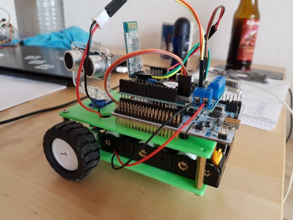

# Autonomous driving with FunduMoto shield

[FunduMoto L298P shield](http://www.mantech.co.za/Datasheets/Products/EX029.pdf) motor driver for Nucleo F446RE board. Based on HAL.

FunduMoto communicates with the [client app](https://github.com/dizcza/FunduMotoJoystick) via Bluetooth UART4 with Periph-to-memory RX DMA (circular mode, RingBuffer).



### Neural Network

A neural network drives the motors to constantly avoid obtacles. It's a DDPG-trained actor-critic model; the real environment is simulated in https://github.com/dizcza/gym-ultrasonic. The training script is [here](https://github.com/dizcza/gym-ultrasonic/blob/master/ddpg.py). The API is in [`gym.h`](https://github.com/dizcza/stm32f446-FunduMoto/blob/nn/Modules/Gym/gym.h), and the usage is shown in [`Gym_Update`](https://github.com/dizcza/stm32f446-FunduMoto/blob/06b22a97b0dcdca7108cb79d1b7bbe334396cfb5/Modules/FunduMoto/fundumoto.c#L315) function.

(The rest of README follows the master branch.)

### Pinout

| OnBoard | Pinout | TIM/UART | Specs |
|---------|--------|----------|-------|
| Motor A | D12 (PA6) direction, D10 (PB6) speed | TIM4\_CH1 | 90 MHz / (100 * 45,000) = 20 Hz |
| Motor B | D13 (PA5) direction, D11 (PA7) speed | TIM14\_CH1 | 90 MHz / (100 * 45,000) = 20 Hz |
| Servo | D9 (PC7) | TIM3\_CH2 | 90 MHz / (90 * 20,000) = 50 Hz |
| Sonar HC-SR04 | D7 (PA8) Trig, D8 (PA9) Echo | TIM1\_CH1 | 180 MHz / (360 * 50,000) = 10 Hz |
| Bluetooth HC-05 | RX -> PC10 (TX), TX -> PC11 (RX) | UART4 | 9600 Bits/s |

### Initialization

Here is how `FunduMoto_Init()` looks like:

```C
HAL_TIM_PWM_Start_IT(&htim4, TIM_CHANNEL_1);  // motorA (handles interrupts for both motors)
HAL_TIM_PWM_Start(&htim14, TIM_CHANNEL_1);    // motorB
HAL_TIM_PWM_Start_IT(&htim3, TIM_CHANNEL_2);  // servo
HAL_TIM_PWM_Start(&htim1, TIM_CHANNEL_1);     // sonar
```

### Usage

```C
// ... CubeMX initialization of HAL, timers, etc.
FunduMoto_Init();

while (1) {
	FunduMoto_ReadUART();
	FunduMoto_Update();
}
```

`FunduMoto_ReadUART()` pulls, parses, and evaluates received Bluetooth commands.

`FunduMoto_Update()` filters and sends sonar distance, read at interrupts.

### Bluetooth RX commands

You can also use Bluetooth terminal to receive commands.
* Motor `M<angle:4d>,<velocity:.2f>`: set vehicle's velocity amplitude and angle for the next `FunduMoto_MotorCycles` cycles (25 ms).
* Servo `S<angle:3d>`: set servo angle.
* Buzzer `B<state:1d>`: on/off buzzer.
* Dist `D<dist:3d>`: set sonar max dist in cm (default is 400 cm).
* Tolerance `T<tol:1d>`: set sonar tolerance in cm (default is 1 cm).
* Filter `F<size:1d>`: set sonar median filter size (default is 3).

### Difference with Arduino pinout connection

FunduMoto schield connects Bluetooth to D1 and D0, which are used by USART2 debugger, embedded in Nucleo board. Instead, I connect Bluetooth to PC10 and PC11.

### Possible issues

1. Wrong motor(s) direction. Just switch '+' and '-' pins.
2. Sonar does not work realiably. Onboard yellow connector pins wiring is weak and you might loose the connection with the sonar when servo rotates and pulls the wire. Better to connect Trig and Echo pins directly to D7 and D8 pins.

